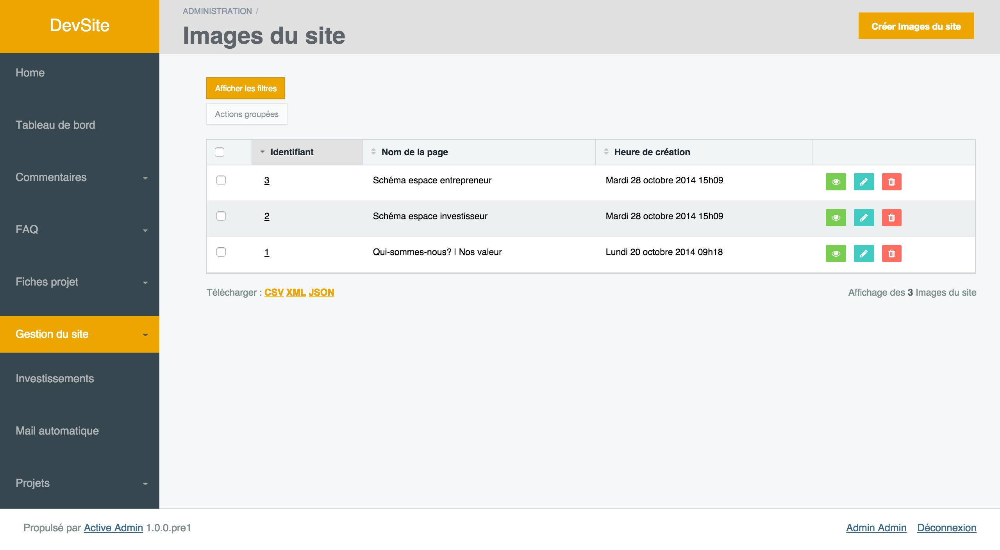
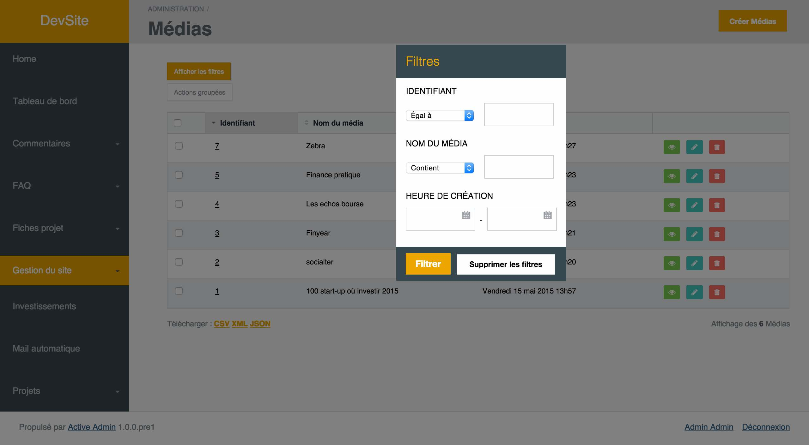
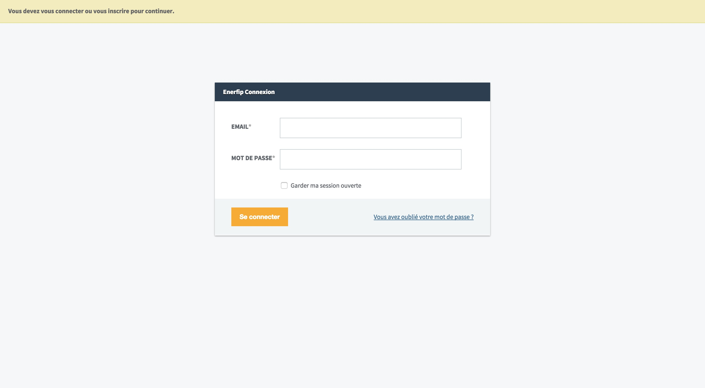
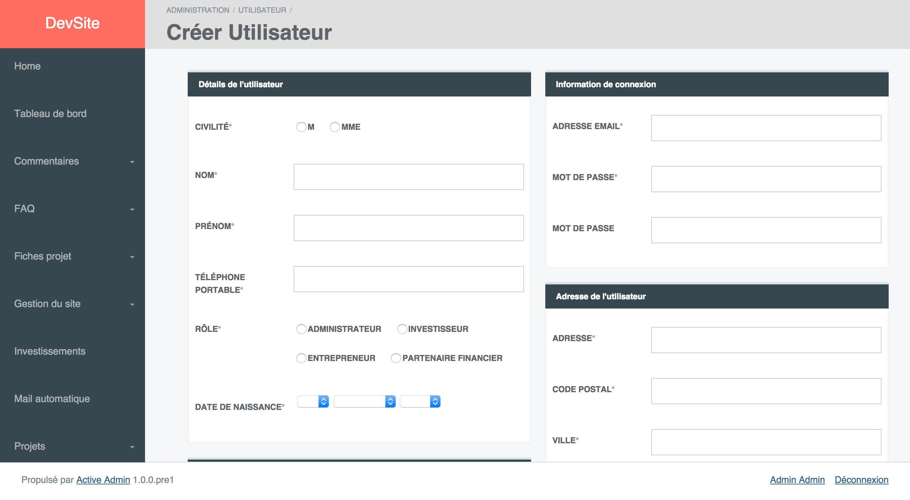
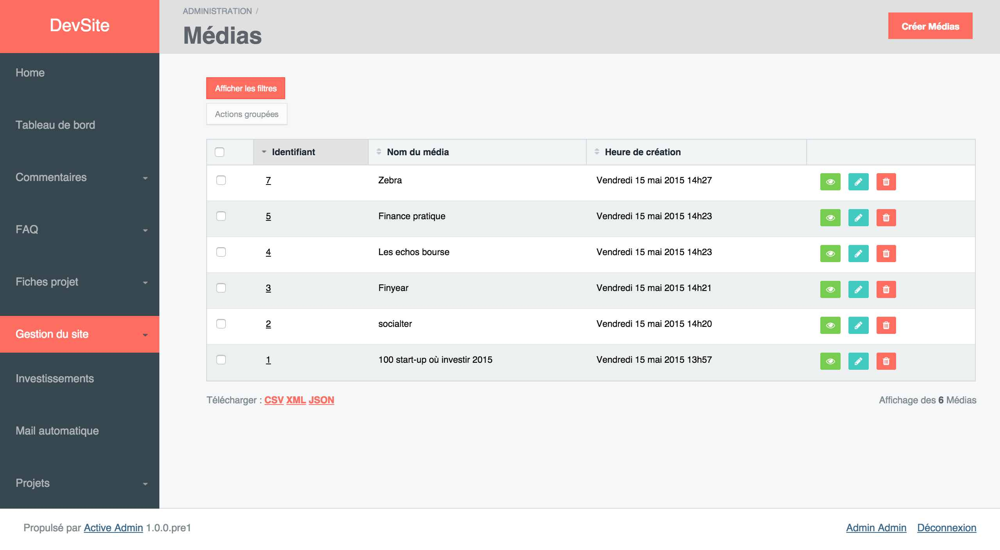

# ActiveAdminFlatSkin
[](http://badge.fury.io/rb/active_admin_flat_skin)

Flat skin for active admin.

## Screens

<table>
  <tr>
    <td>
      <a href="./files/1.jpg"></a>
    </td>
    <td>
      <a href="./files/2.jpg"></a>
    </td>
  </tr>
  <tr>
    <td>
      <a href="./files/3.jpg"></a>
    </td>
    <td>
      <a href="./files/4.jpg"></a>
    </td>
  </tr>
</table>

## Installation

As active_skin is the css theme for the [active_admin](https://github.com/gregbell/active_admin) administration framework - you have to install if first.

Having active admin installed add the following line to your application's Gemfile:

```ruby
gem 'active_admin_flat_skin'
```

And then execute:

    $ bundle

Or install it yourself as:

    $ gem install active_admin_flat_skin


## Usage

include active flat skin css

    # active_admin.css.scss

    @import "active_admin/mixins";
    @import "active_admin/base";
    ...
    @import "active_admin_flat_skin";
    ...

include also font awesome 

    # active_admin.css.scss
     
    @import "font-awesome";
    
include active flat skin js

    # active_admin.js

    //= require active_admin/base
    ...
    //= require active_admin_flat_skin
    ...

You can even change basic colors of the theme by placing some other variables:

    ...
    $panelBorder: #babdc5;
    $skinActiveColor: #e73c3c;
    $bodyColor: rgba(236, 240, 241, 0.48);
    $skinBlack: rgb(55, 71, 79);
    $panelHeaderBck: $skinBlack;
    $skinBlackLight: rgb(69, 90, 100);
    $textGray: rgb(174, 179, 181);
    $skinTextColor: #1e2a33;
    $skinTextActiveColor: white;
    $skinTextTable: #7f8c8d;
    $skinHeaderBck: #1e2a33;
    ...

### Color examples

<table>
  <tr>
    <td colspan=2>
      <a href="./files/color2.jpg"></a>
    </td>
  </tr>
  <tr>
    <td>
      <a href="./files/color1.jpg"></a>
    </td>
    <td>
      <a href="./files/color3.jpg"></a>
    </td>
  </tr>
</table>

## Contributing

1. Fork it ( https://github.com/ayann/active_admin_flat_skin/fork )
2. Create your feature branch (`git checkout -b my-new-feature`)
3. Commit your changes (`git commit -am 'Add some feature'`)
4. Push to the branch (`git push origin my-new-feature`)
5. Create a new Pull Request